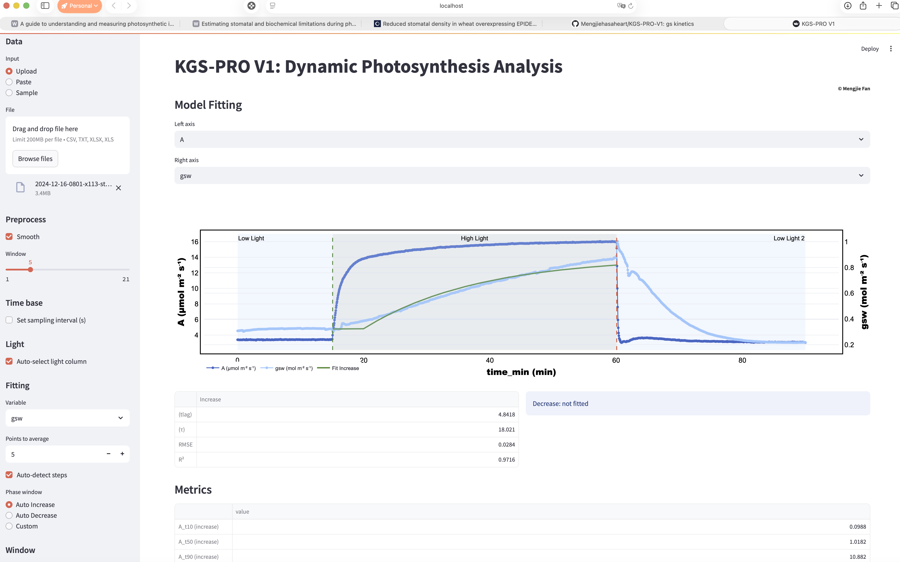
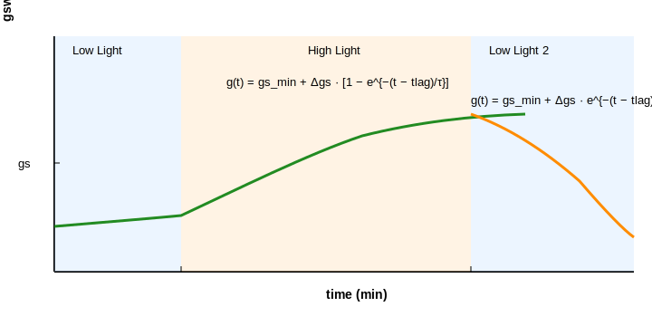

# KGS‑PRO V1 (Preview)

For analysis of dynamic photosynthesis (From LI‑6800 raw files),hosted on Streamlit (for dev preview).
#### © Mengjie Fan 2024

## Main Web Interface on Streamlit  

### Kinetics Model (demo)

## Data Ingestion (LI‑6800): drag and drop raw xlsx file freshly from Li-6800

## Phase Detection should work most of the time (not tested for diurnal program yet)
 from smoothed PPFD (Qin or best alternative) using plateau aware crossings with fallback to gradient extrema in some cases

## Kinetics & Fitting (gsw)
- Step increase (induction):
  - g(t) = gs_min + Δgs · [1 − exp(−(t − t_lag)/τ)]
- Step decrease (relaxation):
  - g(t) = gs_min + Δgs · exp(−(t − t_lag)/τ)
- gs_min and gs_max estimated from endpoints of each phase; τ (time constant) and t_lag fitted with least squares and sensible bounds.

## Some other useful Metrics for dyn photosynthesis (Induction)
- Percent times: t10, t50, t90 to reach 10/50/90% of Δ under increase.
- Deficits: ∫(A_max − A) dt and ∫(gs_max − gsw) dt during induction.
- SLmax (approx): max[1 − (A_norm/gs_norm)] during induction.

## Stomatal vs Biochemical Limitations (Partition)
- Farquhar‑type model (temperature corrected) , can be from ur ACi measurement:
  - Ac = Vcmax · (Ci − Γ*) / (Ci + Kc·(1 + O/Ko))
  - Aj = J · (Ci − Γ*) / (4·Ci + 8·Γ*),  with J from a non‑rectangular hyperbola (α, θ)
  - A_model = min(Ac, Aj) − Rd
- High‑light calibration at steady state: optional overrides for Vcmax25/Jmax25 and Rd.
- Limitations (time‑resolved), see paper in the reference tab to download (scroll down to the bottom of the app):
  - SL = (A_pot − A) / A_max
  - BL = (A_max − A_pot) / A_max
  - TL = (A_max − A) / A_max

- Reference PDFs are bundled under “References” in the app for quick download.
- Most tables and figures are downloadable if you hover over the right corner of these objects

